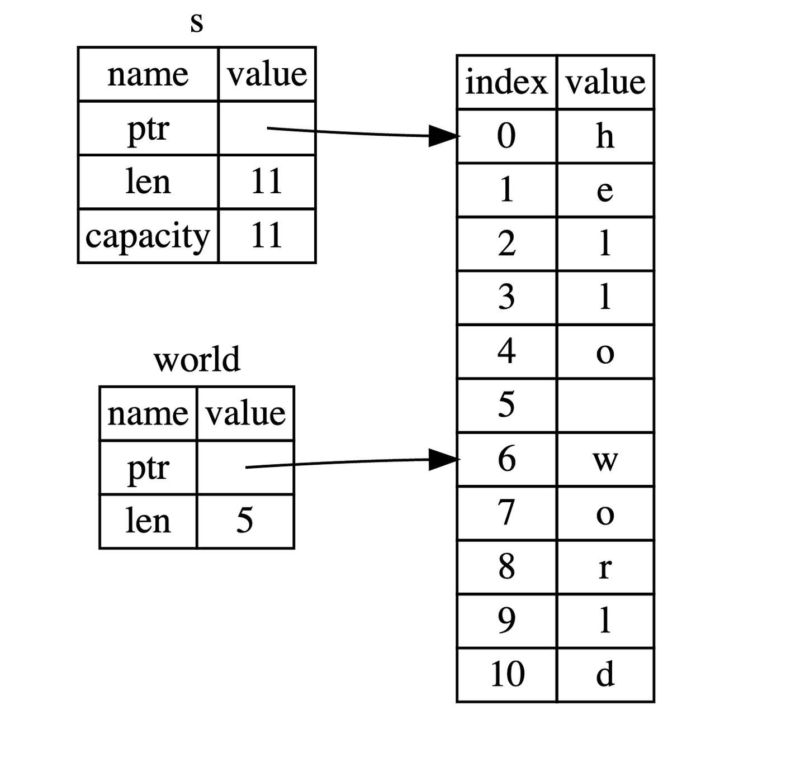

# string

在其他语言中，字符串往往是送分题，因为实在是太简单了，例如`"hello, world"`就是字符串章节的几乎全部内容了，但是如果你带着同样的想法来学`Rust`，我保证，绝对会栽跟头，因此这一章大家一定要重视，仔细阅读。

## 切片(slice)

切片并不是`Rust`独有的概念，在`Go`语言中就非常流行，它允许你引用集合中部分连续的元素序列，而不是引用整个集合。
```rust
let s = String::from("hello world");

let hello = &s[0..5];
let world = &s[6..11];
```

`hello`没有引用整个`String s`，而是引用了`s`的一部分内容，通过`[0..5]`的方式来指定。

这就是创建切片的语法，使用方括号包括的一个序列：**[开始索引..终止索引]**，其中开始索引是切片中第一个元素的索引位置，而终止索引是最后一个元素后面的索引位置。换句话说，这是一个`右半开区间`（或称为左闭右开区间）——指的是在区间的左端点是包含在内的，而右端点是不包含在内的。在切片数据结构内部会保存开始的位置和切片的长度，其中长度是通过`终止索引 - 开始索引`的方式计算得来的。

对于`let world = &s[6..11];`来说，`world`是一个切片，该切片的指针指向`s`的第`7`个字节(索引从`0`开始, `6`是第`7`个字节)，且该切片的长度是`5`个字节。



**range语法实现字符串切片**

如果你想从索引`0`开始截取字符串：
```rust
let s = String::from("hello");

let slice = &s[0..2];
let slice = &s[..2];
```

如果你想截取字符串最后一位：
```rust
let s = String::from("hello");

let len = s.len();

let slice = &s[4..len];
let slice = &s[4..];
```

如果你想截取整个字符串：
```rust
let s = String::from("hello");

let len = s.len();

let slice = &s[0..len];
let slice = &s[..];
```
:::tip
在对字符串使用**切片**语法时需要格外小心，切片的索引必须落在字符之间的边界位置，也就是`UTF-8`字符的边界，例如中文在`UTF-8`中占用三个字节，下面的代码就会崩溃：
```rust
 let s = "中国人";
 let a = &s[0..2];
 println!("{}",a);
```
因为我们只取`s`字符串的前两个字节，但是本例中每个汉字占用三个字节，因此没有落在边界处，也就是连`中`字都取不完整，此时程序会直接崩溃退出，如果改成`&s[0..3]`，则可以正常通过编译。 
:::

## 其它切片

因为切片是对集合的部分引用，因此不仅仅字符串有切片，其它集合类型也有，例如数组：
```rust
let a = [1, 2, 3, 4, 5];

let slice = &a[1..3];

assert_eq!(slice, &[2, 3]);
```
该数组切片的类型是`&[i32]`，数组切片和字符串切片的工作方式是一样的，例如持有一个引用指向原始数组的某个元素和长度。

## 字符串字面量是切片
之前提到过字符串字面量，但是没有提到它的类型：
```rust
let s = "Hello, world!";
```
实际上，`s`的类型是`&str`，因此你也可以这样声明：
```rust
let s: &str = "Hello, world!";
```
该切片指向了程序可执行文件中的某个点，这也是为什么字符串字面量是不可变的，因为`&str`是一个不可变引用。

