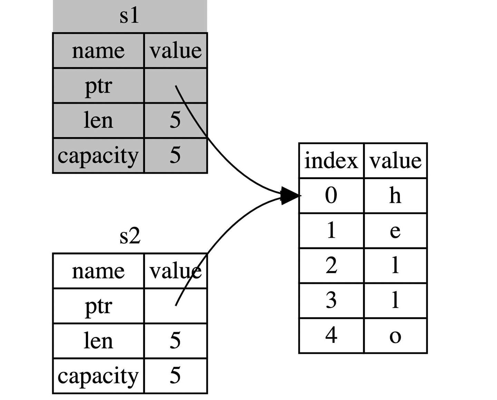

# Ownership

所有的程序都必须和计算机内存打交道，如何从内存中申请空间来存放程序的运行内容，如何在不需要的时候释放这些空间，成了重中之重，也是所有编程语言设计的难点之一。在计算机语言不断演变过程中，出现了三种流派：
1. 垃圾回收机制(GC)，在程序运行时不断寻找不再使用的内存，典型代表：`JavasSript`、`Go`
2. 手动管理内存的分配和释放, 在程序中，通过函数调用的方式来申请和释放内存，典型代表：`C++`
3. 通过所有权来管理内存，编译器在编译时会根据一系列规则进行检查

其中 Rust 选择了第三种，最妙的是，这种检查只发生在编译期，因此对于程序运行期，不会有任何性能上的损失。

在本章，我们将通过`字符串`来引导讲解所有权的相关知识。

## 栈(Stack)与堆(Heap)

栈和堆是编程语言最核心的数据结构，但是在很多语言中，你并不需要深入了解栈与堆。 但对于`Rust`这样的系统编程语言，值是位于栈上还是堆上非常重要，因为这会影响程序的行为和性能。

栈和堆的核心目标就是为程序在运行时提供可供使用的内存空间。

## 栈

栈按照顺序存储值并以相反顺序取出值，这也被称作**后进先出**。想象一下一叠盘子：当增加更多盘子时，把它们放在盘子堆的顶部，当需要盘子时，再从顶部拿走。不能从中间也不能从底部增加或拿走盘子！

增加数据叫做**进栈**，移出数据则叫做**出栈**。

因为上述的实现方式，栈中的所有数据都必须占用已知且固定大小的内存空间，假设数据大小是未知的，那么在取出数据时，你将无法取到你想要的数据。

## 堆

与栈不同，对于大小未知或者可能变化的数据，我们需要将它存储在堆上。

当向堆上放入数据时，需要请求一定大小的内存空间。操作系统在堆的某处找到一块足够大的空位，把它标记为已使用，并返回一个表示该位置地址的**指针**，该过程被称为在**堆上分配内存**，有时简称为 “分配”(allocating)。

接着，该指针会被推入**栈**中，因为指针的大小是已知且固定的，在后续使用过程中，你将通过栈中的指针，来获取数据在堆上的实际内存位置，进而访问该数据。

由上可知，堆是一种缺乏组织的数据结构。想象一下去餐馆就座吃饭：进入餐馆，告知服务员有几个人，然后服务员找到一个够大的空桌子（堆上分配的内存空间）并领你们过去。如果有人来迟了，他们也可以通过桌号（栈上的指针）来找到你们坐在哪。

**性能区别**

在栈上分配内存比在堆上分配内存要快，因为入栈时操作系统无需进行函数调用（或更慢的系统调用）来分配新的空间，只需要将新数据放入栈顶即可。相比之下，在堆上分配内存则需要更多的工作，这是因为操作系统必须首先找到一块足够存放数据的内存空间，接着做一些记录为下一次分配做准备，如果当前进程分配的内存页不足时，还需要进行系统调用来申请更多内存。 因此，**处理器在栈上分配数据会比在堆上分配数据更加高效**。

## 所有权与堆栈

当你的代码调用一个函数时，传递给函数的参数（包括可能指向堆上数据的指针和函数的局部变量）依次被压入栈中，当函数调用结束时，这些值将被从栈中按照相反的顺序依次移除。

因为堆上的数据缺乏组织，因此跟踪这些数据何时分配和释放是非常重要的，否则堆上的数据将产生内存泄漏 —— 这些数据将永远无法被回收。这就是 Rust 所有权系统为我们提供的强大保障。

对于其他很多编程语言，你确实无需理解堆栈的原理，但是在**Rust 中，明白堆栈的原理，对于我们理解所有权的工作原理会有很大的帮助**。

## 所有权原则

:::tip
1. Rust 中每一个值都被一个变量所拥有，该变量被称为值的所有者。
2. 一个值同时只能被一个变量所拥有，或者说一个值只能拥有一个所有者。
3. 当所有者（变量）离开作用域范围时，这个值将被丢弃(drop)。
:::

## 变量作用域
如下 创建了一个变量`s`

```rust
{                      // s 在这里无效，它尚未声明
    let s = "hello";   // 从此处起，s 是有效的

    // 使用 s
}  
```
`s`从创建开始就有效，然后有效期持续到它离开作用域为止，可以看出，就作用域来说`Rust`语言跟其他编程语言没有区别。

## 简单介绍 String 类型

我们已经见过字符串字面值`let s = "hello"`,`s` 是被硬编码进程序里的字符串值（类型为`&str`）。字符串字面值是很方便的，但是它并不适用于所有场景。
原因有二:
1. 字符串字面值是不可变的，因为被硬编码到程序代码中。
2. 并非所有字符串的值都能在编写代码时得知。
例如，字符串是需要程序运行时，通过用户动态输入然后存储在内存中的，这种情况，字符串字面值就完全无用武之地。 为此`Rust`为我们提供动态字符串类型:`String`，该类型被分配到堆上，因此可以动态伸缩，也就能存储在编译时大小未知的文本。

可以使用下面的方法基于字符串字面量来创建 String 类型：
```rust
let s = String::from("hello");
```
`::`是一种调用操作符，这里表示调用`String`类型中的`from`关联函数，由于`String`类型存储在堆上，因此它是动态的，你可以这样修改：
```rust
let mut s = String::from("hello");

s.push_str(", world!"); // push_str() 在字符串后追加字面值

println!("{}", s); // 将打印 `hello, world!`
```
了解`String`后，一起来看看关于所有权的交互。

<!-- ## 变量绑定背后的数据交互 -->

## 转移所有权

看一个示例

```rust
let x = 5;
let y = x;
```
这段代码并**没有发生**所有权的转移，原因很简单: 代码首先将`5`绑定到变量`x`，接着拷贝`x`的值赋给`y`，最终`x`和`y`都等于`5`，因为整数是`Rust基本数据类型`，是固定大小的简单值，因此这两个值都是通过`自动拷贝`的方式来赋值的，都被存在`栈`中，完全无需在堆上分配内存。

在看另一个不同的示例
```rust
let s1 = String::from("hello");
let s2 = s1;
```
由于`String`类型是一个`复杂类型`，由存储在栈中的**堆指针、字符串长度、字符串容量**共同组成，其中**堆指针**是最重要的，它指向了真实存储字符串内容的堆内存，至于长度和容量，如果你有`Go`语言的经验，这里就很好理解：容量是堆内存分配空间的大小，长度是目前已经使用的大小。

总之`String`类型指向了一个堆上的空间，这里存储着它的真实数据，下面对上面代码中的`let s2 = s1`分成两种情况讨论：
1. 拷贝`String`和存储在堆上的字节数组 如果该语句是拷贝所有数据(深拷贝)，那么无论是`String`本身还是底层的堆上数据，都会被全部拷贝，这对于性能而言会造成非常大的影响
2. 只拷贝`String`本身 这样的拷贝非常快，因为在`64`位机器上就拷贝了`8`字节的指针、`8`字节的长度、`8`字节的容量，总计`24`字节，但是带来了新的问题，还记得我们之前提到的所有权规则吧？其中有一条就是：**一个值只允许有一个所有者**，而现在这个值（堆上的真实字符串数据）有了两个所有者: `s1`和`s2`。

假定一个值可以拥有两个所有者:
当变量离开作用域后，`Rust`会自动调用`drop`函数并清理变量的堆内存。不过由于两个`String`变量指向了同一位置。这就有了一个问题：当`s1`和`s2`离开作用域，它们都会尝试释放相同的内存。这是一个叫做 二次释放（double free） 的错误，也是之前提到过的内存安全性`BUG`之一。两次释放（相同）内存会导致内存污染，它可能会导致潜在的安全漏洞。(c语言常犯的错误，内存二次释放)

因此，`Rust`这样解决问题：当`s1`被赋予`s2`后，`Rust`认为`s1`不再有效，因此也无需在`s1`离开作用域后`drop`任何东西，这就是把所有权从`s1`转移给了`s2`，`s1`在被赋予`s2`后就马上失效了。

再来看看，在所有权转移后再来使用旧的所有者，会发生什么：

```rust
let s1 = String::from("hello");
let s2 = s1;

println!("{}, world!", s1);
```

由于 Rust 禁止你使用无效的引用，此时会报错

如同js中常常提起的：**浅拷贝(shallow copy)**和**深拷贝(deep copy)**，那么拷贝指针、长度和容量而不拷贝数据听起来就像浅拷贝，但是又因为`Rust`同时使第一个变量`s1`无效了，因此这个操作被称为**移动(move)**，而不是浅拷贝。上面的例子可以解读为`s1`被移动到了`s2`中。那么具体发生了什么，用一张图简单说明：



这样就解决了我们之前的问题，`s1`不再指向任何数据，只有`s2`是有效的，当`s2`离开作用域，它就会释放内存。 相信此刻，你应该明白了，为什么`Rust`称呼`let a = b`为变量绑定了吧？

再来看一段代码:

```rust
fn main() {
    let x: &str = "hello, world";
    let y = x;
    println!("{},{}",x,y);
}
```

这段代码和之前的`String`有一个本质上的区别：在`String`的例子中`s1`持有了通过`String::from("hello")`创建的值的**所有权**，而这个例子中，`x`只是引用了存储在二进制可执行文件(**binary**)中的字符串`"hello, world"`，并没有持有所有权

因此`let y = x`中，仅仅是对该引用进行了**拷贝**，此时`y`和`x`都引用了同一个字符串。

## 克隆(深拷贝)

首先，`Rust`永远也不会自动创建数据的**深拷贝**。因此，任何自动的复制都不是深拷贝，可以被认为对运行时性能影响较小。

如果我们确实需要深度复制`String`中堆上的数据，而不仅仅是栈上的数据，可以使用一个叫做`clone`的方法。

```rust
let s1 = String::from("hello");
let s2 = s1.clone();

println!("s1 = {}, s2 = {}", s1, s2);
```
::: tip
如果代码性能无关紧要，例如初始化程序时或者在某段时间只会执行寥寥数次时，你可以使用`clone`来简化编程。但是对于执行较为频繁的代码（热点路径），使用`clone `会极大的降低程序性能，需要小心使用！
:::

## 拷贝(浅拷贝)

浅拷贝只发生在栈上，因此性能很高，在日常编程中，浅拷贝无处不在。

`Rust`有一个叫做`Copy`的特征，可以用在类似整型这样在栈中存储的类型。如果一个类型拥有`Copy`特征，一个旧的变量在被赋值给其他变量后仍然可用，也就是赋值的过程即是拷贝的过程。

那么什么类型是可`Copy`的呢？可以查看给定类型的文档来确认，这里可以给出一个通用的规则： **任何基本类型的组合可以`Copy` ，不需要分配内存或某种形式资源的类型是可以`Copy`的**。如下是一些`Copy`的类型：
1. 所有整数类型，比如`u32`
2. 布尔类型，`bool`，它的值是`true`和`false`
3. 所有浮点数类型，比如`f64`
4. 字符类型，`char`（**注意不是字符串**）
5. 元组，当且仅当其包含的类型也都是`Copy`的时候。比如，`(i32, i32)`是Copy的，但`(i32, String)`就不是
6. 不可变引用`&T`，例如转移所有权中的最后一个例子，但是注意：可变引用`&mutT` 是不可以`Copy`的

## 函数传值与返回

将值传递给函数，一样会发生 移动 或者 复制，就跟 let 语句一样，下面的代码展示了所有权、作用域的规则：
```rust
fn main() {
    let s = String::from("hello");  // s 进入作用域

    takes_ownership(s);             // s 的值移动到函数里 ...
                                    // ... 所以到这里不再有效

    let x = 5;                      // x 进入作用域

    makes_copy(x);                  // x 应该移动函数里，
                                    // 但 i32 是 Copy 的，所以在后面可继续使用 x

} // 这里, x 先移出了作用域，然后是 s。但因为 s 的值已被移走，
  // 所以不会有特殊操作

fn takes_ownership(some_string: String) { // some_string 进入作用域
    println!("{}", some_string);
} // 这里，some_string 移出作用域并调用 `drop` 方法。占用的内存被释放

fn makes_copy(some_integer: i32) { // some_integer 进入作用域
    println!("{}", some_integer);
} // 这里，some_integer 移出作用域。不会有特殊操作
```

同样的，函数返回值也有所有权，例如:

```rust
fn main() {
    let s1 = gives_ownership();         // gives_ownership 将返回值
                                        // 移给 s1

    let s2 = String::from("hello");     // s2 进入作用域

    let s3 = takes_and_gives_back(s2);  // s2 被移动到
                                        // takes_and_gives_back 中,
                                        // 它也将返回值移给 s3
} // 这里, s3 移出作用域并被丢弃。s2 也移出作用域，但已被移走，
  // 所以什么也不会发生。s1 移出作用域并被丢弃

fn gives_ownership() -> String {             // gives_ownership 将返回值移动给
                                             // 调用它的函数

    let some_string = String::from("hello"); // some_string 进入作用域.

    some_string                              // 返回 some_string 并移出给调用的函数
}

// takes_and_gives_back 将传入字符串并返回该值
fn takes_and_gives_back(a_string: String) -> String { // a_string 进入作用域

    a_string  // 返回 a_string 并移出给调用的函数
}

```
所有权很强大，避免了内存的不安全性，但是也带来了一个新麻烦： 总是把一个值传来传去来使用它。 传入一个函数，很可能还要从该函数传出去，结果就是语言表达变得非常啰嗦，幸运的是，`Rust`提供了新功能解决这个问题。