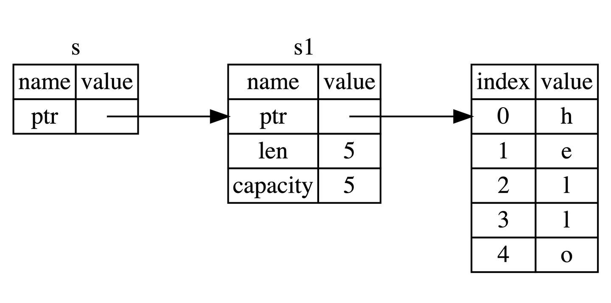

# quote（引用与借用）

上节中提到，如果仅仅支持通过转移所有权的方式获取一个值，那会让程序变得复杂。`Rust`能否像其它编程语言一样，使用某个变量的指针或者引用呢？答案是可以。

`Rust`通过**借用(Borrowing)**这个概念来达成上述的目的，获取变量的引用，称之为**借用(borrowing)**。正如现实生活中，如果一个人拥有某样东西，你可以从他那里借来，当使用完毕后，也必须要物归原主。

## 引用与解引用

常规引用是一个指针类型，指向了对象存储的内存地址。在下面代码中，我们创建一个`i32`值的引用`y`，然后使用解引用运算符来解出`y`所使用的值:

```rust
fn main() {
    let x = 5;
    let y = &x;

    assert_eq!(5, x);
    assert_eq!(5, *y);
}
```

变量`x`存放了一个`i32`值`5`。`y`是`x`的一个引用。可以断言`x`等于`5`。然而，如果希望对`y`的值做出断言，必须使用`*y`来解出引用所指向的值（也就是解引用）。一旦解引用了`y`，就可以访问`y`所指向的整型值并可以与 5 做比较。

## 不可变引用

下面的代码，我们用`s1`的引用作为参数传递给`calculate_length`函数，而不是把`s1`的所有权转移给该函数：
```rust
fn main() {
    let s1 = String::from("hello");

    let len = calculate_length(&s1);

    println!("The length of '{}' is {}.", s1, len);
}

fn calculate_length(s: &String) -> usize {
    s.len()
}
```

能注意到两点：

1. 无需像上章一样：先通过函数参数传入所有权，然后再通过函数返回来传出所有权，代码更加简洁`calculate_length`的参数`s`类型从`String`变为`&String`
2. 这里`&`符号即是**引用**，它们允许你使用值，但是不获取所有权，如图所示：


通过`&s1`语法，我们创建了一个指向`s1`的引用，但是并不拥有它。因为并不拥有这个值，当引用离开作用域后，其指向的值也不会被丢弃。

同理，函数`calculate_length`使用`&`来表明参数`s`的类型是一个引用：
```rust
fn calculate_length(s: &String) -> usize { // s 是对 String 的引用
    s.len()
} // 这里，s 离开了作用域。但因为它并不拥有引用值的所有权，
  // 所以什么也不会发生

```
光借用已经满足不了我们了，如果尝试修改借用的变量呢？
```rust
fn main() {
    let s = String::from("hello");

    change(&s);
}

fn change(some_string: &String) {
    some_string.push_str(", world");
}
```

正如变量默认不可变一样，引用指向的值默认也是不可变的，没事，来一起看看如何解决这个问题。

## 可变引用

只需要一个小调整，即可修复上面代码的错误：
```rust
fn main() {
    let mut s = String::from("hello");

    change(&mut s);
}

fn change(some_string: &mut String) {
    some_string.push_str(", world");
}
```
首先，声明`s`是可变类型，其次创建一个可变的引用`&mut s`和接受可变引用参数`some_string: &mut String`的函数

## 可变引用同时只能存在一个

不过可变引用并不是随心所欲、想用就用的，它有一个很大的限制： **同一作用域，特定数据只能有一个可变引用**：
```rust
let mut s = String::from("hello");

let r1 = &mut s;
let r2 = &mut s;

println!("{}, {}", r1, r2);
```
这段代码出错的原因在于，第一个可变借用`r1`必须要持续到最后一次使用的位置`println!`，在`r1`创建和最后一次使用之间，我们又尝试创建第二个可变借用`r2`。

这种限制的好处就是使 Rust 在编译期就避免数据竞争，数据竞争可由以下行为造成：

1. 两个或更多的指针同时访问同一数据
2. 至少有一个指针被用来写入数据
3. 没有同步数据访问的机制
4. 数据竞争会导致未定义行为，这种行为很可能超出我们的预期，难以在运行时追踪，并且难以诊断和修复。而 Rust 避免了这种情况的发生，因为它甚至不会编译存在数据竞争的代码！

很多时候，大括号可以帮我们解决一些编译不通过的问题，通过手动限制变量的作用域：
```rust
let mut s = String::from("hello");

{
    let r1 = &mut s;

} // r1 在这里离开了作用域，所以我们完全可以创建一个新的引用

let r2 = &mut s;

```
## 可变引用与不可变引用不能同时存在

下面的代码会导致一个错误：
```rust
let mut s = String::from("hello");

let r1 = &s; // 没问题
let r2 = &s; // 没问题
let r3 = &mut s; // 大问题

println!("{}, {}, and {}", r1, r2, r3);

```
:::tip
注意，引用的作用域`s`从创建开始，一直持续到它最后一次使用的地方，这个跟变量的作用域有所不同，变量的作用域从创建持续到某一个花括号`}`
:::

## NLL
对于这种编译器优化行为，`Rust`专门起了一个名字 —— `Non-Lexical Lifetimes(NLL)`，专门用于找到某个引用在作用域(`}`)结束前就不再被使用的代码位置。

## 悬垂引用(Dangling References)

悬垂引用也叫做悬垂指针，意思为指针指向某个值后，这个值被释放掉了，而指针仍然存在，其指向的内存可能不存在任何值或已被其它变量重新使用。在`Rust`中编译器可以确保引用永远也不会变成悬垂状态：当你获取数据的引用后，编译器可以确保数据不会在引用结束前被释放，要想释放数据，必须先停止其引用的使用。

让我们尝试创建一个悬垂引用，`Rust`会抛出一个编译时错误：
```rust
fn main() {
    let reference_to_nothing = dangle();
}

fn dangle() -> &String {
    let s = String::from("hello");

    &s
}
```
**this function's return type contains a borrowed value, but there is no value for it to be borrowed from.**
该函数返回了一个借用的值，但是已经找不到它所借用值的来源


仔细看看 dangle 代码的每一步到底发生了什么：
```rust
fn dangle() -> &String { // dangle 返回一个字符串的引用

    let s = String::from("hello"); // s 是一个新字符串

    &s // 返回字符串 s 的引用
} // 这里 s 离开作用域并被丢弃。其内存被释放。
  // 危险！

```

因为`s`是在`dangle`函数内创建的，当`dangle`的代码执行完毕后，`s`将被释放，但是此时我们又尝试去返回它的引用。这意味着这个引用会指向一个无效的`String`，这可不对！

其中一个很好的解决方法是直接返回`String`,最终`String`的**所有权被转移给外面的调用者**。：
```rust
fn no_dangle() -> String {
    let s = String::from("hello");

    s
}

```

## 借用规则总结

总的来说，借用规则如下：

1. 同一时刻，你只能拥有要么一个可变引用，要么任意多个不可变引用。
2. 引用必须总是有效的。